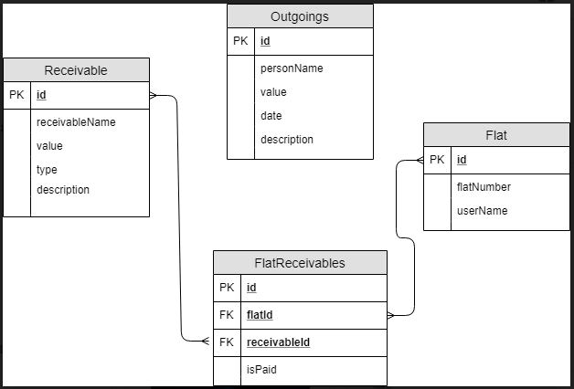

# Flat-System
As the system was required to be a web-based application, I preferred to use Laravel framework as it’s a fast, easy, also I am still learning it online so I wanted to improve my experience in it by practicing, also it’s an MVC which provides a good structure for my system. So the system flow will be like this: First the system goes to the route then to the controller, then to the view, then to the model.

# Database Schema

